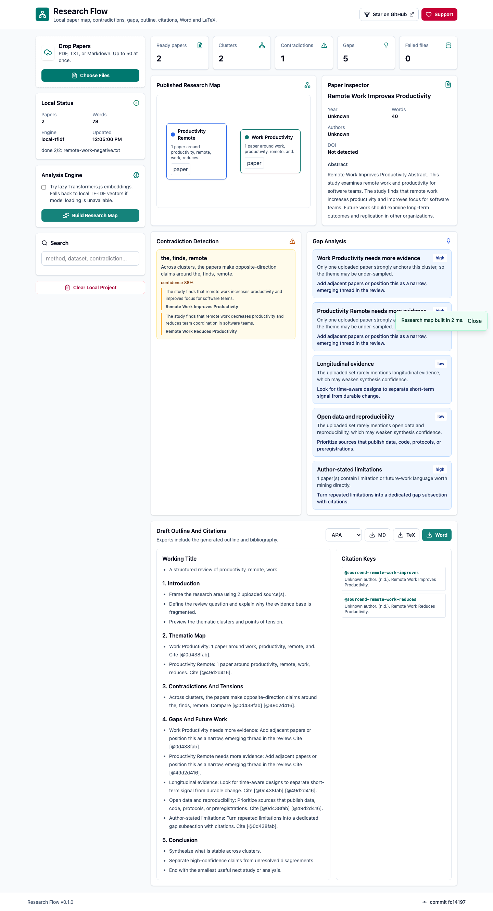
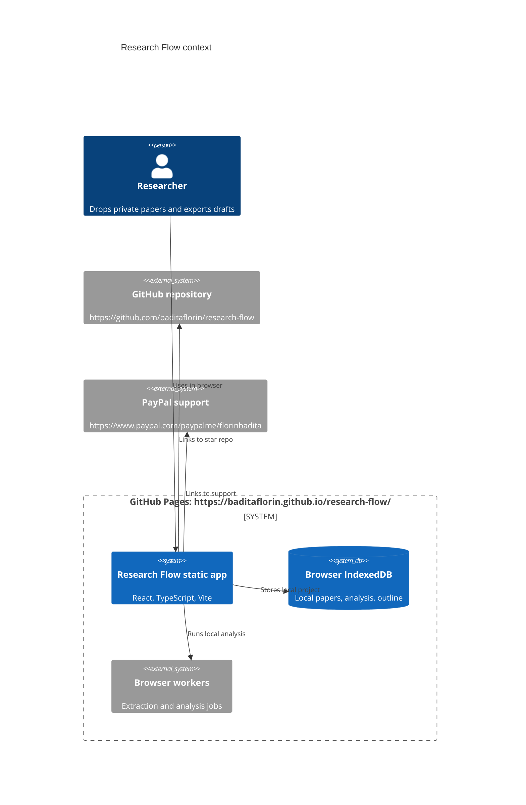

# Research Flow


Live site: https://baditaflorin.github.io/research-flow/

Repository: https://github.com/baditaflorin/research-flow

Support: https://www.paypal.com/paypalme/florinbadita

Research Flow is a private browser research workspace for clustering papers, finding gaps, drafting outlines, and exporting cited Word/LaTeX. It is built for PhD students, academics, analysts, and deep readers who want one local-first URL for the "I'm researching X" flow.



## Quickstart

```sh
npm install
make install-hooks
make dev
```

## Verified Capabilities

- Drop or choose up to 50 PDF, TXT, Markdown, BibTeX, or Research Flow state files.
- Paste paper text or rendered HTML, read clipboard text with permission, load a built-in sample, or try a CORS-readable URL.
- Extract text and metadata locally in the browser, with review states for scanned, corrupt, partial, or metadata-only inputs.
- Build a semantic research map with local TF-IDF vectors and optional persisted lazy Transformers.js embeddings.
- Search the uploaded library with a local MiniSearch index.
- Detect evidence-linked contradiction candidates.
- Generate gap cards and a draft outline.
- Format citations and export Markdown, Word `.docx`, and LaTeX `.tex` with provenance and confidence metadata.
- Copy Markdown drafts, copy bibliography/BibTeX, print the current analysis, and create a small-project share URL.
- Export/import a portable `.research-flow.json` project state file for browser-to-browser transfer.
- Persist the latest project and settings in browser storage, with migration from the v1 IndexedDB shape.
- Show app version and source commit on the GitHub Pages UI.

## Tested Limits

- `npm run test:realdata` passes 10 individual real-world fixtures plus one six-paper batch fixture.
- OCR is not included. Scanned PDFs are marked as needing OCR or better text.
- URL import is limited by browser CORS because the app remains pure GitHub Pages with no backend proxy.
- Citation formatting is lightweight and local, not a full CSL replacement.

## Architecture



Detailed architecture: docs/architecture.md

ADRs: docs/adr/

Deployment guide: docs/deploy.md

Privacy: docs/privacy.md

Postmortem: docs/postmortem.md

Phase 2 postmortem: docs/postmortem-phase2-substance.md

Phase 3 postmortem: docs/postmortem-phase3.md

## Commands

```sh
make help
make lint
make test
make test-realdata
make build
make smoke
make pages-preview
```

## Deployment

GitHub Pages serves `main` branch `/docs`.

Live URL: https://baditaflorin.github.io/research-flow/

Rollback is a git revert of the publishing commit, then push `main`.

## Security

No papers are uploaded in v1. No analytics are enabled. No frontend secrets exist. Local hooks run linting, tests, build checks, smoke tests, and `gitleaks protect --staged`.

## License

MIT
