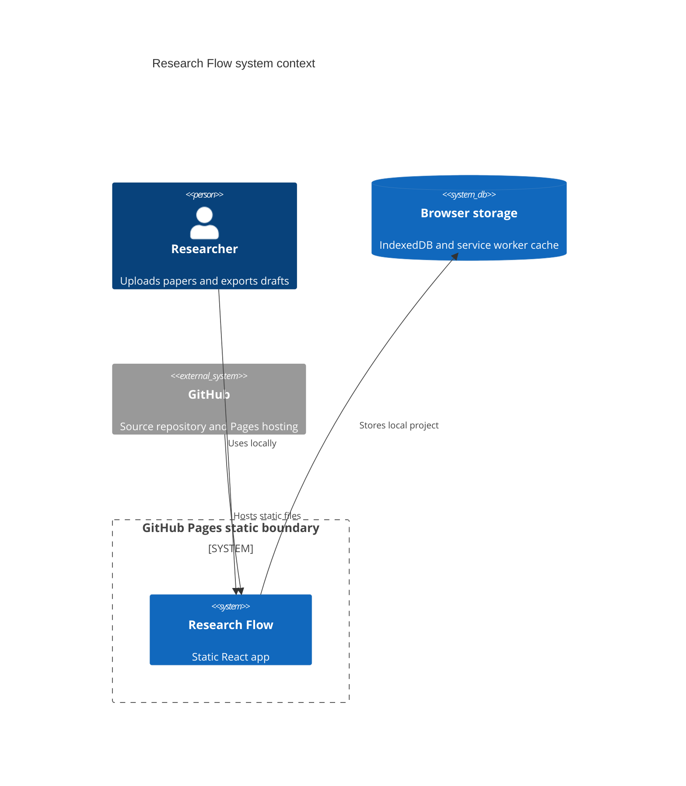
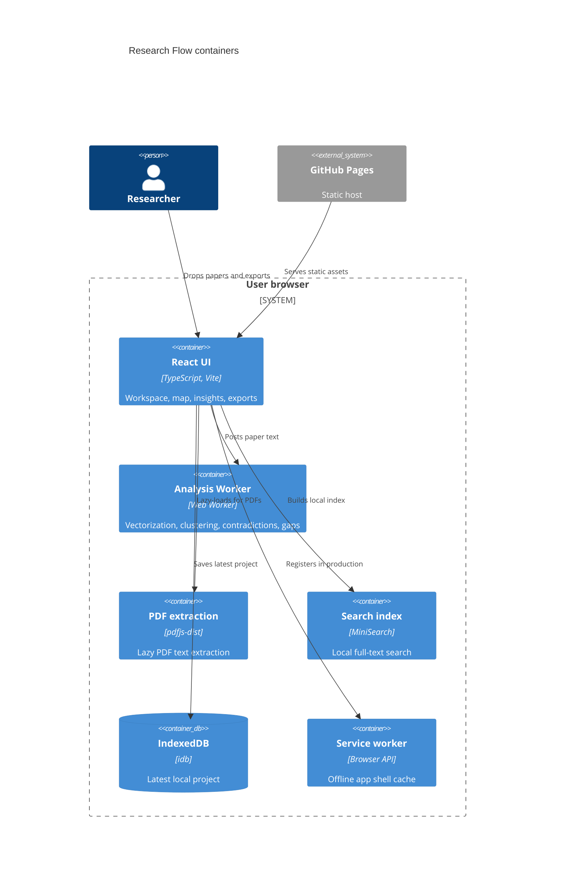
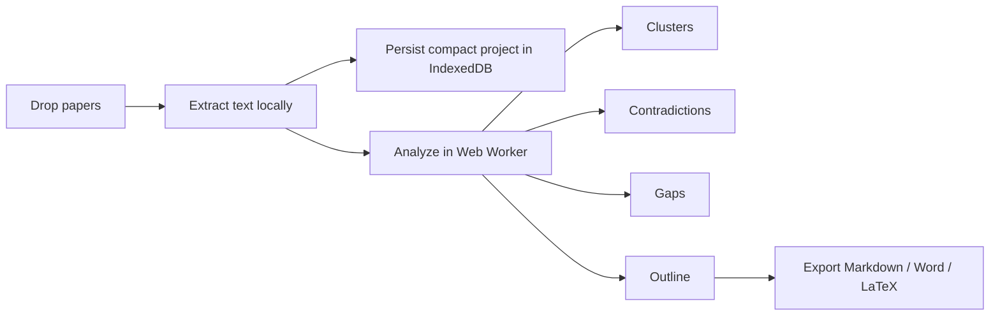

# Architecture

## Context

Research Flow is Mode A: a pure GitHub Pages application. The public surface is static; user papers and generated research maps stay inside the user's browser.

Live site: https://baditaflorin.github.io/research-flow/

Repository: https://github.com/baditaflorin/research-flow

## Container View

## Module Boundaries

- `src/features/library`: file ingestion, PDF/text extraction, metadata inference.
- `src/features/analysis`: vectors, clustering, contradiction detection, gap analysis, outline generation.
- `src/features/search`: MiniSearch index construction and querying.
- `src/features/export`: citations, Markdown, Word, and LaTeX exports.
- `src/features/storage`: IndexedDB persistence.
- `src/workers`: worker entrypoints for CPU-heavy analysis.
- `src/shared`: build metadata, formatting, error boundaries, service worker registration.

## Pages Boundary

GitHub Pages serves only committed static files under `docs/`. There is no runtime API, auth layer, server database, Docker image, nginx proxy, or metrics endpoint.

## Runtime Data Flow

